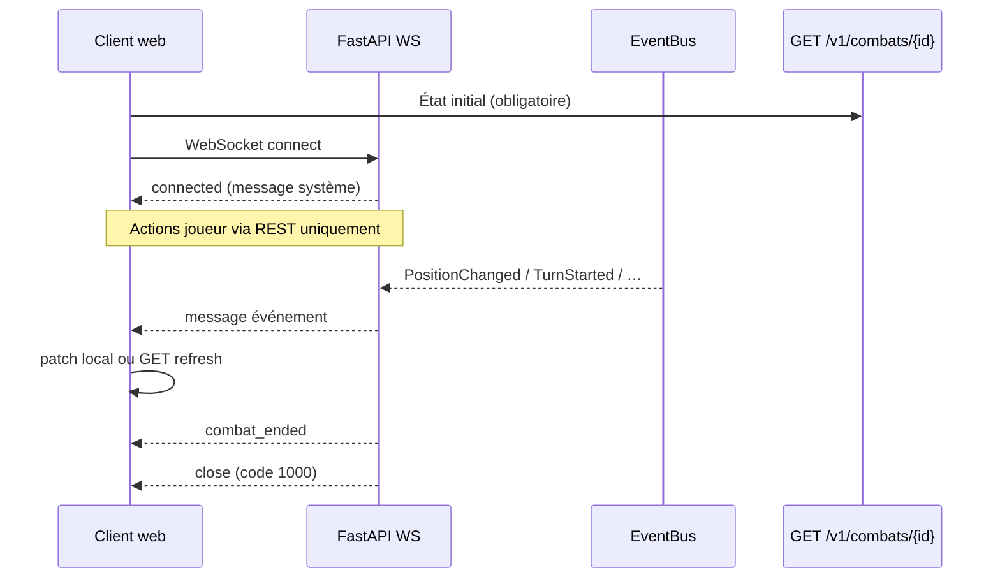

# Contrat WebSocket — v1 (rencontre / combat)

| Attribut | Valeur |
|---|---|
| **Statut** | **Accepté** (mainteneur 2026-08-13 — amendements invalidation, 4404, dette keep-alive, tests broadcast) |
| **Date** | 2026-08-13 |
| **Périmètre** | Transport temps réel pour l'écran `#/combat/{id}` — complément du contrat REST [`CONTRAT.md`](CONTRAT.md) |
| **Prérequis** | Lot 6a map REST ✅ · lot 8 géométrie ✅ · brief [`BRIEF_LOT6C_WEBSOCKET.md`](../web/BRIEF_LOT6C_WEBSOCKET.md) |
| **Hors périmètre** | Auth multi-poste · Redis / bus distribué · modèle scène/campagne · actions de jeu via WS |

**Relation avec REST** : [`CONTRAT.md`](CONTRAT.md) reste la **source de vérité** pour l'état combat et toutes les **actions** (`POST …/move`, `…/attack`, etc.). Le WebSocket est un **canal de notification** : il pousse des deltas ou signale un rafraîchissement ; il ne remplace pas REST.

**Alignement produit** : canal **rencontre-scoped** (`combat_id`) — pas de canal « scène » tant que le modèle scène n'existe pas ([`VISION.md`](../../VISION.md) §4.0, §10 D9).

---

## 1. Principes

| # | Règle |
|---|---|
| W1 | **Aucune action de jeu** via WebSocket — toutes les mutations passent par REST v1. |
| W2 | **Aucune règle D&D** dans la couche transport (`interfaces/api/` uniquement pour le WS). |
| W3 | Les messages WS **reprennent** des événements déjà publiés sur l'EventBus (ADR-003) — pas de second calcul métier. |
| W4 | Le client **6a** (refresh manuel après action) reste **obligatoire** comme fallback. |
| W5 | État initial à l'ouverture du canal : **`GET /v1/combats/{combat_id}?viewer=`** — le WS ne envoie pas de snapshot complet au `connect`. |
| W6 | Identité `viewer` (query) = même sémantique que REST — filtrage fiche / sorts côté sérialiseur inchangé. |

---

## 2. Endpoint et connexion

### 2.1 URL

```
WS /v1/combats/{combat_id}/ws?viewer={character_id}
```

| Paramètre | Obligatoire | Description |
|---|---|---|
| `combat_id` | Oui | Entier — même identifiant que REST `/v1/combats/{combat_id}` |
| `viewer` | Non | `character_id` du poste — même query que `GET /v1/combats/{id}` |

**Exemple dev** (proxy Vite → uvicorn) :

```
ws://127.0.0.1:8000/v1/combats/42/ws?viewer=abc123
```

En production derrière le client Vite : URL relative `ws://${location.host}/v1/combats/42/ws?viewer=…` ou équivalent HTTPS `wss://`.

### 2.2 Cycle de vie



| Phase | Comportement |
|---|---|
| **Ouverture** | Le serveur **accepte** la connexion WebSocket, puis **ferme immédiatement** avec le code applicatif **`4404`** si le combat est introuvable. **Aucun** message `connected` dans ce cas. |
| **Connecté** | Serveur envoie un message système `connected` (§3.2). |
| **Pendant le combat** | Broadcast des événements MVP (§4) filtrés par `combat_id`. |
| **Fin de rencontre** | Message `combat_ended` puis fermeture serveur (code WebSocket `1000`). |
| **Client déconnecté** | Reconnexion avec backoff (§5) + `GET` état complet — **sauf** fermeture **`4404`** (§5.1). |

**Rejet combat inexistant (normatif)** : code de fermeture WebSocket **`4404`** (plage applicative 4000–4999), **après** acceptation du handshake. Motif : un refus HTTP 404 avant upgrade produit une erreur opaque côté navigateur ; `4404` est lisible et permet d'afficher « combat introuvable » plutôt que « connexion perdue ».

### 2.3 Connexions multiples

- Plusieurs onglets / postes sur le **même** `combat_id` : **autorisé**.
- Chaque connexion reçoit les mêmes messages de broadcast pour ce combat.
- Pas de synchronisation cross-combat sur un même socket.

### 2.4 Keep-alive

- **Ping/pong** WebSocket natif (Starlette/FastAPI) — pas de message applicatif `ping` custom en MVP.

**Dette explicite (v1 banc local)** : le **timeout idle** n'est pas normé côté contrat. En local, le client compense via reconnexion (§5). **Si déploiement derrière un reverse proxy** (nginx, cloud load balancer) : risque de **déconnexions périodiques silencieuses** (~60 s selon config proxy) — à revoir dans un lot infra ; symptôme attendu = WS coupé sans message `combat_ended`, backoff client actif.

---

## 3. Enveloppe des messages

### 3.1 Format général

Tous les messages sont du **JSON texte** UTF-8, un objet par frame :

```json
{
  "type": "<identifiant>",
  "combat_id": 42,
  "timestamp": "2026-08-13T17:00:00.000000+00:00",
  "payload": {}
}
```

| Champ | Type | Description |
|---|---|---|
| `type` | `string` | Identifiant stable du message (snake_case) — voir §4 |
| `combat_id` | `integer` | Rencontre concernée — aligné REST |
| `timestamp` | `string` | ISO 8601 UTC — copié de `DomainEvent.timestamp` pour les événements métier |
| `payload` | `object` | Corps spécifique au `type` |

### 3.2 Messages système (serveur → client)

#### `connected`

Envoyé **une fois** après acceptation du WebSocket.

```json
{
  "type": "connected",
  "combat_id": 42,
  "timestamp": "2026-08-13T17:00:00.000000+00:00",
  "payload": {
    "viewer": "abc123"
  }
}
```

`payload.viewer` : echo de la query `viewer` (ou `null` si absent).

### 3.3 Messages client → serveur

**Aucun** en MVP — le client ne envoie pas de JSON applicatif.

*(Extension future possible : `subscribe` / `ping` applicatif — hors v1.)*

---

## 4. Événements métier MVP (serveur → client)

Mapping **EventBus → WS** — sérialisation dans `interfaces/api/` (réutiliser la logique de `event_to_record` du tampon diagnostic, **sans** exposer le tampon `/debug/events` comme contrat prod).

| `type` WS | Classe EventBus | Déclencheur typique |
|---|---|---|
| `position_changed` | `PositionChanged` | `POST …/move` réussi |
| `turn_started` | `TurnStarted` | `POST …/advance-turn`, fin de tour auto |
| `combat_ended` | `CombatEnded` | `POST …/close`, auto-close sans combattants actifs |
| `combat_state_invalidated` | *Tout autre* `DomainEvent` combat du même `combat_id` | Attaque, dégâts, soins, sorts, effets, initiative, etc. |

**Filtrage serveur** : ne broadcaster que si `int(event.combat_id) == combat_id` du canal.

**Règle d'invalidation (normative)** : pour tout événement domaine combat publié sur l'EventBus dont la classe **n'est pas** `PositionChanged`, `TurnStarted` ni `CombatEnded`, le hub WS envoie **`combat_state_invalidated`** (et **pas** de message typé dédié en MVP). Cela évite une divergence silencieuse (ex. PV affichés à 30 alors qu'ils sont à 18 après une attaque sur un autre onglet). Ce message **n'est pas** du journal temps réel (arbitrage 10.4) — c'est un signal de resynchronisation.

### 4.1 `position_changed`

```json
{
  "type": "position_changed",
  "combat_id": 42,
  "timestamp": "2026-08-13T17:00:01.123456+00:00",
  "payload": {
    "combatant_id": "a1b2c3d4",
    "from": { "x": 3, "y": 5 },
    "to": { "x": 4, "y": 5 },
    "cost_ft": 5,
    "movement_remaining_ft": 20,
    "round_number": 1,
    "turn_index": 0
  }
}
```

**Effet client attendu** : mettre à jour `combatants[id].position`, `action_budget.movement_remaining_ft` ; rafraîchir la carte. **Alternative autorisée** : `GET /v1/combats/{id}?viewer=` (fallback).

### 4.2 `turn_started`

```json
{
  "type": "turn_started",
  "combat_id": 42,
  "timestamp": "2026-08-13T17:00:02.000000+00:00",
  "payload": {
    "combatant_id": "e5f6g7h8",
    "round_number": 2,
    "turn_index": 0
  }
}
```

**Effet client attendu** : mettre à jour `current_combatant_id`, `round_number` ; réinitialiser les sélecteurs UI si besoin. **Alternative autorisée** : `GET` complet.

### 4.3 `combat_ended`

```json
{
  "type": "combat_ended",
  "combat_id": 42,
  "timestamp": "2026-08-13T17:00:03.000000+00:00",
  "payload": {
    "reason": "closed"
  }
}
```

Valeurs `reason` : `"closed"` | `"no_active_combatants"` (aligné moteur ADR-005) ; autres chaînes possibles en tests.

**Effet client attendu** : afficher combat terminé ; fermer le WS localement si le serveur ne l'a pas déjà fait ; conserver le bouton **Recharger** / retour lobby.

### 4.4 `combat_state_invalidated`

```json
{
  "type": "combat_state_invalidated",
  "combat_id": 42,
  "timestamp": "2026-08-13T17:00:04.000000+00:00",
  "payload": {
    "source_event": "DamageDealt"
  }
}
```

| Champ payload | Obligatoire | Description |
|---|---|---|
| `source_event` | Non | Nom de la classe EventBus à l'origine (diagnostic / logs) — le client **peut ignorer** |

**Effet client attendu (normatif)** : **`GET /v1/combats/{combat_id}?viewer=`** complet — pas de patch partiel obligatoire. Garantit que PV, effets actifs, budget et carte restent cohérents sans mapper événement par événement.

Exemples d'événements source typiques : `DamageDealt`, `AttackRollResolved`, `SpellCast`, `SavingThrowResolved`, `ConditionApplied`, `ActionConsumed`, `InitiativeRolled`, `RoundStarted`, `TurnEnded`, etc.

---

## 5. Reconnexion et fallback client

### 5.1 Stratégie client (normative)

| Situation | Comportement obligatoire |
|---|---|
| WS indisponible au montage | Écran combat **utilisable** via REST seul (comportement 6a). |
| Fermeture WS code **`4404`** | **Ne pas** reconnecter — combat introuvable ; afficher erreur explicite. |
| WS coupé (autre code / réseau) | Backoff exponentiel (ex. 1 s → 2 s → 4 s, plafond 30 s) ; à chaque reconnexion réussie : **`GET` état complet**. |
| Message `combat_state_invalidated` | **`GET` état complet** (normatif). |
| Messages §4.1–4.3 | Appliquer patch décrit **ou** `GET` complet — les deux conformes. |
| Action locale (move, attaque…) | REST puis **GET** (initiateur, arbitrage 10.5) **et** réception WS sur les autres onglets. |

### 5.2 Bouton « Recharger »

**Conservé** — doit continuer à appeler `GET /v1/combats/{id}` indépendamment du WS.

---

## 6. Architecture API (implémentation lot 6c)

### 6.1 Fichiers autorisés

| Zone | Fichiers |
|---|---|
| Contrat | `docs/api/CONTRAT_WS.md` (ce document) |
| API | `interfaces/api/combat_ws.py` (ou module dédié) · branchement dans `app.py` / `combat_routes.py` |
| Tests | `tests/unit/test_api_v1_combat_ws.py` |
| Client | `web/src/lib/api/combat_ws.ts` · hook dans `CombatScreen.svelte` |

### 6.2 Interdit

| Interdit | Raison |
|---|---|
| Modifier `jdr_engine/` pour le transport | D4 — le moteur ne connaît pas l'interface |
| Actions de jeu via WS | W1 |
| Supprimer le refresh REST post-action | W4, régression 6a |
| Canal WS global / scène | VISION §4.0 |
| Dépendance Redis, Celery, etc. | Banc local — AGENTS.md §6 |

### 6.3 Connection manager (recommandation)

- **`CombatWsHub`** (nom indicatif) : registre `combat_id → set[WebSocket]`.
- **Handler EventBus** : abonnement aux types §4 (messages typés) **plus** handler générique ou liste exhaustive pour **`combat_state_invalidated`** sur les autres événements combat.
- Sérialisation WS dans `interfaces/api/ws_serializers.py` (nom indicatif) — **pas** dans `output_serializers.py` (REST).

### 6.4 Tests Python attendus

| # | Cas |
|---|---|
| T1 | Connexion WS sur combat existant → reçoit `connected`. |
| T2 | Après `POST …/move` (autre client simulé) → WS reçoit `position_changed` cohérent. |
| T3 | Après `POST …/attack` (dégâts) → WS reçoit `combat_state_invalidated` (pas seulement les trois types typés). |
| T4 | Après `close` → `combat_ended` + fermeture code `1000`. |
| T5 | Combat inexistant → acceptation puis fermeture code **`4404`**. |
| T6 | **Deux connexions** sur le même `combat_id` reçoivent **toutes les deux** le broadcast d'un même événement. |
| T7 | Connexion sur `combat_id` **42** ne reçoit **aucun** message lors d'un événement sur le combat **43**. |

- **Delta tests** : au moins **+6** tests dédiés WS vs baseline **1018** ([`ROADMAP.md`](../../ROADMAP.md) auto-sync).

---

## 7. Hors périmètre MVP (extensions documentées)

| Extension | Lot / condition |
|---|---|
| Messages WS typés `damage_dealt`, `attack_roll_resolved`, `spell_cast` | Phase 2 — remplacer progressivement `combat_state_invalidated` si besoin perf |
| Journal combat live (texte riche, détail jets) | Brief 6c §10.4 — **hors MVP** ; distinct de `combat_state_invalidated` |
| Auth JWT / rôles MJ-joueur | ÉTAPE 6 auth |
| Bus multi-instance | Déploiement prod |
| Move via WS | **Interdit** (brief §6) |
| Snapshot combat au `connect` | W5 — REST GET uniquement |

---

## 8. Critères d'acceptation du contrat

**Accepté** le 2026-08-13 (mainteneur) après amendements :

1. Message MVP **`combat_state_invalidated`** — resynchronisation GET sur événements non typés.
2. Rejet combat inexistant — fermeture **`4404`** après acceptation.
3. Dette keep-alive / proxy documentée §2.4.
4. Tests T6–T7 (broadcast multi-connexion, isolation `combat_id`).
5. Arbitrages §10 actés.
6. Parcours §9 réalisable avec les quatre types MVP.

---

## 9. Parcours de validation (post-implémentation)

1. Onglet A : combat actif, viewer A — **move** d'un jeton.
2. Onglet B : même `combat_id`, viewer B — **sans** Recharger, le jeton se déplace (`position_changed`).
3. Onglet A : **attaque** réussie infligeant des dégâts.
4. Onglet B : **sans** Recharger manuel, reçoit `combat_state_invalidated` puis PV / carte cohérents après GET automatique.
5. Onglet B : fin de tour depuis A → tour courant mis à jour (`turn_started`).
6. Clôture depuis A → B reçoit `combat_ended`.
7. Connexion WS sur combat inexistant → fermeture **`4404`**, pas de boucle de reconnexion.
8. Arrêt uvicorn → les deux onglets restent jouables via REST + Recharger.

---

## 10. Arbitrages actés (2026-08-13)

| # | Décision | Statut |
|---|---|---|
| 10.1 | Canal **rencontre** only (`/v1/combats/{id}/ws`) | **Accepté** |
| 10.2 | Keep-alive **ping/pong** natif | **Accepté** |
| 10.3 | État initial via **GET REST** uniquement | **Accepté** |
| 10.4 | Journal temps réel (`damage_dealt` typé, texte riche) **hors MVP** — `combat_state_invalidated` **n'est pas** du journal | **Accepté** |
| 10.5 | Initiateur d'action conserve **GET post-REST** en plus du WS | **Accepté** |
| 10.6 | `combat_id` JSON **entier** (aligné REST), converti depuis `str` EventBus | **Accepté** |
| 10.7 | Quatrième message MVP **`combat_state_invalidated`** sur tout événement combat non typé | **Accepté** |
| 10.8 | Combat inexistant → fermeture WS **`4404`** après acceptation ; client **sans** reconnexion | **Accepté** |

---

## 11. Gate documentaire

**Gate levée** (2026-08-13) : ce document et le brief [`BRIEF_LOT6C_WEBSOCKET.md`](../web/BRIEF_LOT6C_WEBSOCKET.md) sont **Acceptés**.

Ordre d'implémentation : **API WS → tests (§6.4 T1–T7) → client → validation §9**.

---

## 12. Références

- [`docs/api/CONTRAT.md`](CONTRAT.md) — REST v1
- [`docs/web/BRIEF_LOT6C_WEBSOCKET.md`](../web/BRIEF_LOT6C_WEBSOCKET.md) — brief lot
- [`docs/adr/ADR-003-Pourquoi-utiliser-un-EventBus.md`](../adr/ADR-003-Pourquoi-utiliser-un-EventBus.md)
- [`docs/adr/ADR-007-stack-client-web.md`](../adr/ADR-007-stack-client-web.md)
- `jdr_engine/core/events/combat_events.py` — champs événements source
- `interfaces/api/diagnostic/event_buffer.py` — sérialisation JSON de référence (dev)
